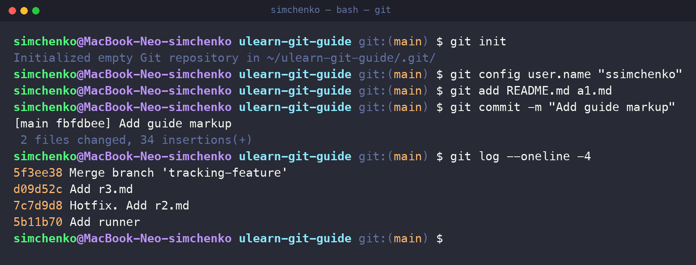
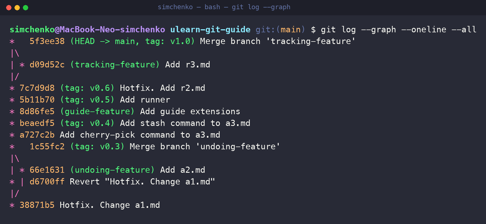

# Git Coursework — ULearn


> **Coursework repository — not a pet project.**

This repository contains a Git study guide I created during university practice at Ural Federal University using the [ULearn Git course](https://ulearn.me/course/git) developed by Kontur. It is based on the official [`kontur-courses/ulearn-git-guide`](https://github.com/kontur-courses/ulearn-git-guide) training repository.

The assignment was designed so that Git was both the subject and the working tool: each meaningful step was committed separately, larger topics were developed in dedicated branches, and completed stages were marked with version tags.

## Work in Practice



*Repository initialization, a focused commit, and history inspection.*



*The actual course history with feature branches, merge commits, version tags, and a safe revert.*

## What I Practised

- Creating and configuring repositories, authorship, and `.gitignore`
- Building focused commits through the working tree and staging area
- Developing topics in isolated feature branches and merging them into `main`
- Marking completed milestones with version tags
- Editing and undoing history with `amend`, `reset`, `revert`, and `rebase`
- Moving work with `cherry-pick` and `stash`
- Working with remotes through `fetch`, `pull`, and `push`
- Configuring upstream branches and tracking relationships
- Resolving merge conflicts and reviewing changes through Pull Requests
- Creating practical Git aliases for everyday work

## Evidence in the Repository

- **30+ focused commits** documenting the course work step by step
- **9 branches** for feature development, merge practice, review, and tracking
- **8 tags** marking milestones from `v0.1` to `v1.0`
- **5 merge commits across the repository refs** demonstrating non-linear history
- A dedicated [`revert` commit](https://github.com/ssimchenko/ulearn-git-guide/commit/f0e7156) that safely undoes an earlier change
- Platform-specific Git configuration for Windows and Unix-like systems

The complete live history can be inspected through the repository's [commit graph](https://github.com/ssimchenko/ulearn-git-guide/network), [branches](https://github.com/ssimchenko/ulearn-git-guide/branches), and [tags](https://github.com/ssimchenko/ulearn-git-guide/tags).

## Repository Structure

```text
├── c1.md–c3.md   # Configuration, authentication, and Git setup
├── s1.md–s3.md   # Repositories, commits, references, branches, and tags
├── a1.md–a3.md   # Merge, history editing, cherry-pick, stash, and rebase
├── r1.md–r3.md   # Remotes, push, fetch, pull, and branch tracking
├── .gitconfig-*  # Practical Git settings and aliases for Windows and Unix
└── index.html    # Browser view that combines the course notes
```

## Result

The result is a complete Markdown-based Git guide with a history that can be inspected as part of the work itself. The repository demonstrates not only knowledge of individual commands, but also a disciplined workflow built around small commits, isolated changes, readable history, and controlled integration into the main branch.

- [Git course on ULearn](https://ulearn.me/course/git)
- [Final course section](https://ulearn.me/Course/git/Zadanie_P3_2_Itogi_7d9931bc-e5db-4ae2-b041-5a3d4b321d37)

## Author

**Alexander Simchenko** — [GitHub](https://github.com/ssimchenko)
