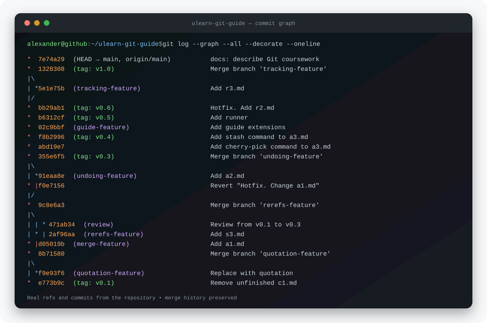
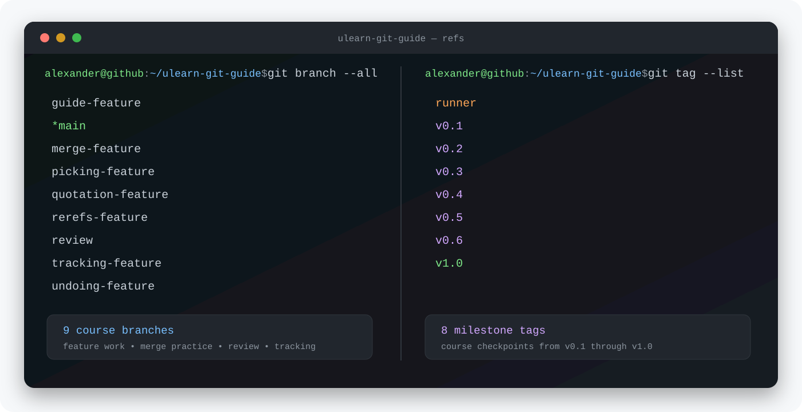

# Git Course Practice — ULearn


> **Coursework repository — not a pet project.**

This repository contains practical assignments completed during a university Git course on [ULearn](https://ulearn.me/course/git). The course materials were created by Kontur, and the repository was forked from the official [`kontur-courses/ulearn-git-guide`](https://github.com/kontur-courses/ulearn-git-guide) training repository.

The repository preserves the actual branch, tag, and merge history produced while completing the exercises. Its purpose is to demonstrate practical Git knowledge rather than present a standalone software product.

## Git History at a Glance



The graph is the main result of this repository: it shows a non-linear workflow with isolated feature branches, explicit merge commits, milestone tags, review work, and a safe revert.



## Skills Practised

- Repository creation, cloning, configuration, and `.gitignore`
- Staging changes and creating focused commits
- Working with `HEAD`, branches, tags, and detached states
- Feature-branch development and merge workflows
- Resolving merge conflicts with `mergetool`
- Rewriting and undoing changes with `amend`, `reset`, and `revert`
- Moving changes with `cherry-pick`, `stash`, and `rebase`
- Working with remotes through `fetch`, `pull`, and `push`
- Configuring upstream branches and tracking relationships
- Authentication through SSH and HTTPS Credential Manager
- Pull Request and code review workflow fundamentals
- Creating practical Git aliases for everyday work

## Evidence in the Repository

- **30+ commits** created throughout the course
- **9 branches**, including dedicated feature, merge, review, and tracking branches
- **8 tags**, with course milestones from `v0.1` to `v1.0`
- **5 merge commits across the repository refs** demonstrating non-linear history
- A dedicated [`revert` commit](https://github.com/ssimchenko/ulearn-git-guide/commit/f0e7156) that safely undoes an earlier change
- Platform-specific Git configuration for Windows and Unix-like systems

The complete live history can be inspected through the repository's [commit graph](https://github.com/ssimchenko/ulearn-git-guide/network), [branches](https://github.com/ssimchenko/ulearn-git-guide/branches), and [tags](https://github.com/ssimchenko/ulearn-git-guide/tags).

## Repository Structure

```text
├── c1.md–c3.md   # Configuration, authentication, and Git setup
├── s1.md–s3.md   # Repositories, commits, references, branches, and tags
├── a1.md–a3.md   # Merge, history editing, cherry-pick, stash, and rebase
├── r1.md–r3.md   # Remotes, push, fetch, pull, and branch tracking
├── .gitconfig-*  # Practical Git settings and aliases for Windows and Unix
└── index.html    # Browser view that combines the course notes
```

## Course Result

The final part of the course covers creating repositories on GitHub, developing features in separate branches, integrating work into the main branch, and reviewing changes through Pull Requests.

- [Git course on ULearn](https://ulearn.me/course/git)
- [Final course section](https://ulearn.me/Course/git/Zadanie_P3_2_Itogi_7d9931bc-e5db-4ae2-b041-5a3d4b321d37)

## Author

**Alexander Simchenko** — [GitHub](https://github.com/ssimchenko)
